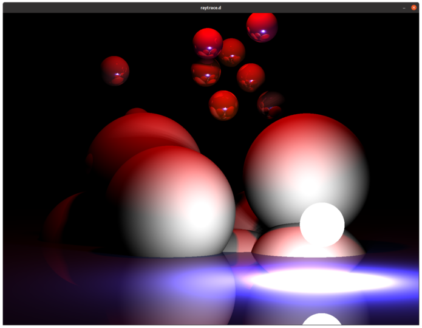

# Raytrace.d

A simple ray tracer implemented in D. Features:
* Volumetric lights and soft shadows
* Reflections
* Rendering spheres and planes. Need to work on more interesting objects :)



Requires a [D compiler](https://dlang.org/), and the [GktD bindings](https://gtkd.org/download.html).

Easiest to compile using the provided [Dockerfile](Dockerfile):

```
# Installs D, runs tests and compiles project
docker build -t raytraced:v1 .

# Copy binary to host filesystem. Since it creates a window, it's easier to run outside docker
docker create -ti --name build raytraced:v1
docker cp /raytraced raytraced
docker rm -f build

# Run the program! Width & height optional
./raytraced --width 1440 --height 1080
```

Right now, a basic scene consisting of spheres and planes is randomly generated at startup.